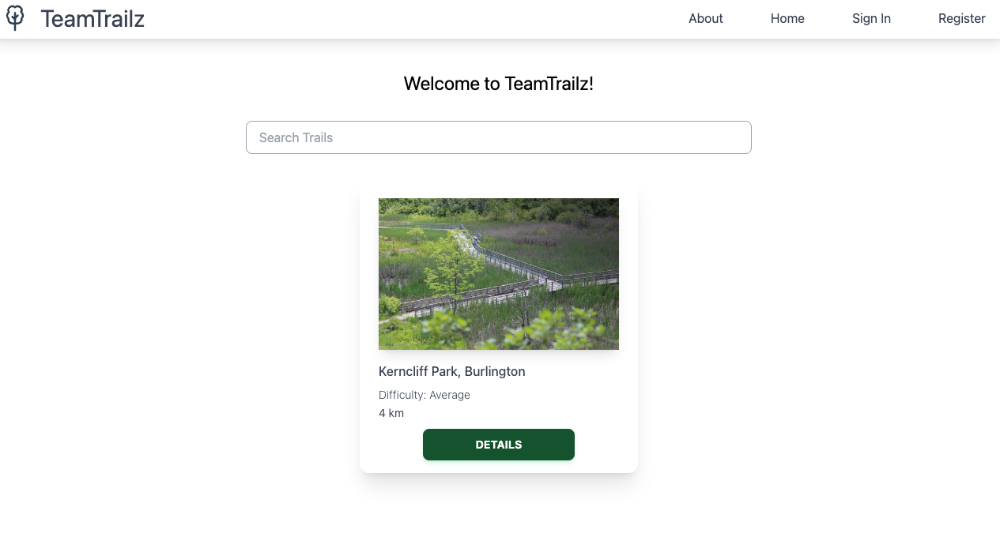
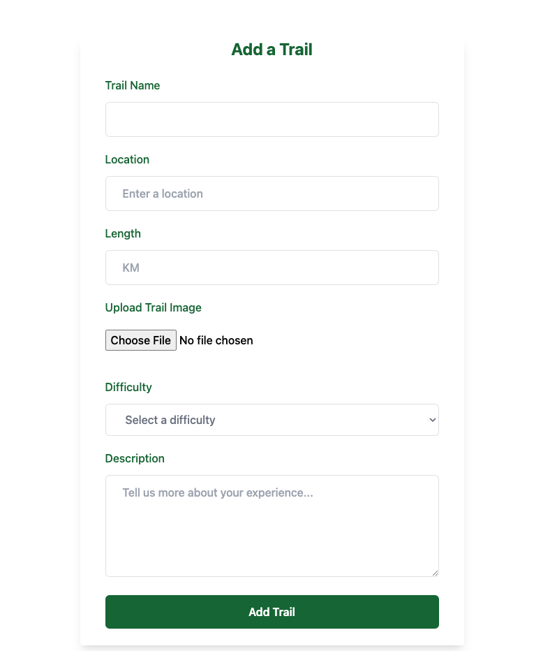

# **TeamTrailz**

## **[TeamTrailz Page](https://team-trailz-e41981a5de26.herokuapp.com/){:target="_blank"}**

## [TeamTrailz Trello](https://trello.com/b/LXTcGWGX/team-trailz){:target="_blank"}

TeamTrailz mission is simple: to connect and inspire fellow nature enthusiasts by sharing our favourite trails, one step at a time.

### **Landing Page**

### **Add Trail**

 

### **Technologies Used**

- HTML
- CSS
- JavaScript
- MongoDB
- Express
- React
- Node.js
- Atlas
- Heroku
- Google Maps & Places API
- Bcrypt

 

### **Icebox Items**

- Author Trail Edit (in progress)
- User Favourites 
- OAUTH
- Comments section for each individual trail
- Multi Photo option, cycle through photos on trail details page
- Updated logo
- Leaderboards 
- Expansion on info provided for each trail --> suggested parking areas, what to pack, latest conditions, pet friendly, etc.
- User option to "like" trails --> X amount of hikers, similar to fb/insta likes
- Option for users to reply to comments --> Chain
- Different tiers for users --> ex. only mods can delete trails that have been added
